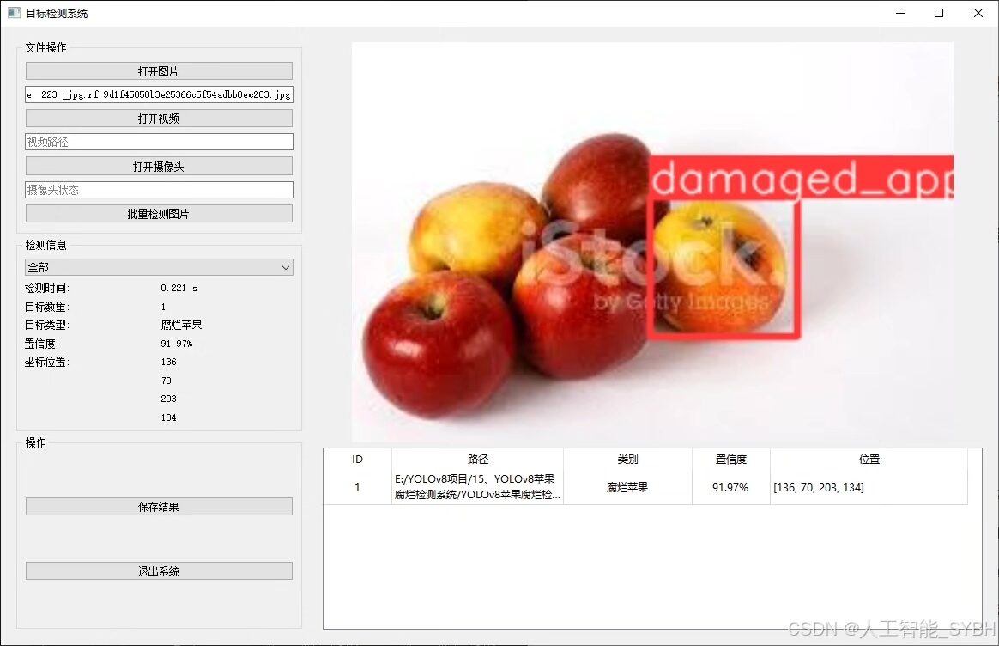
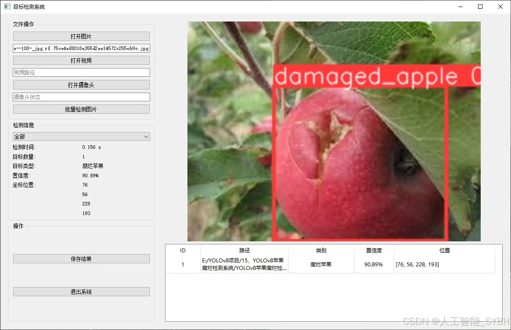
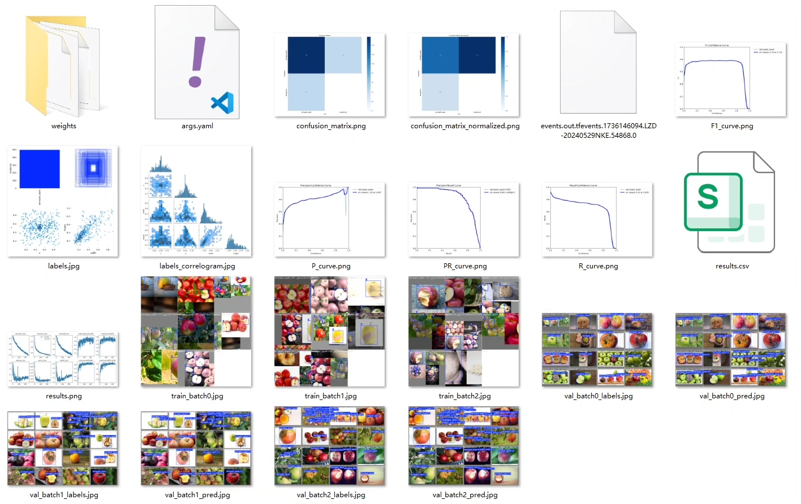
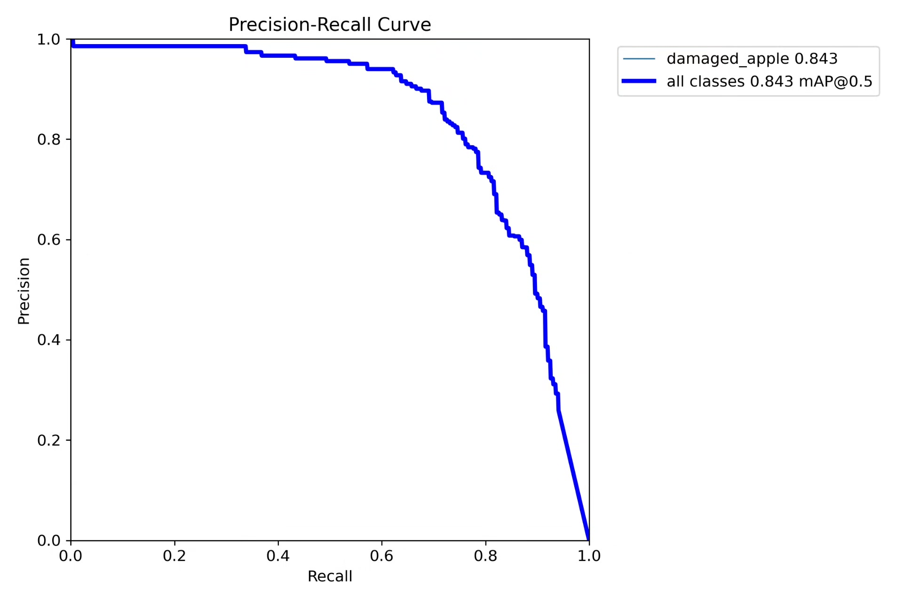
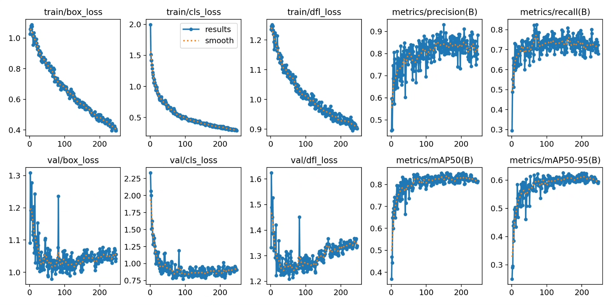
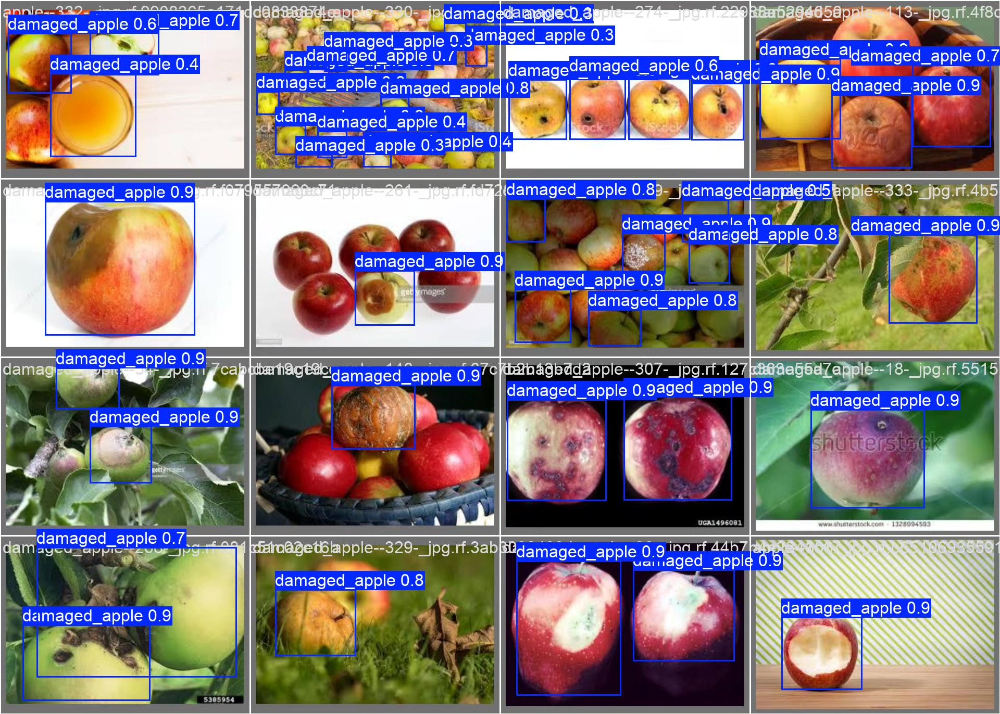
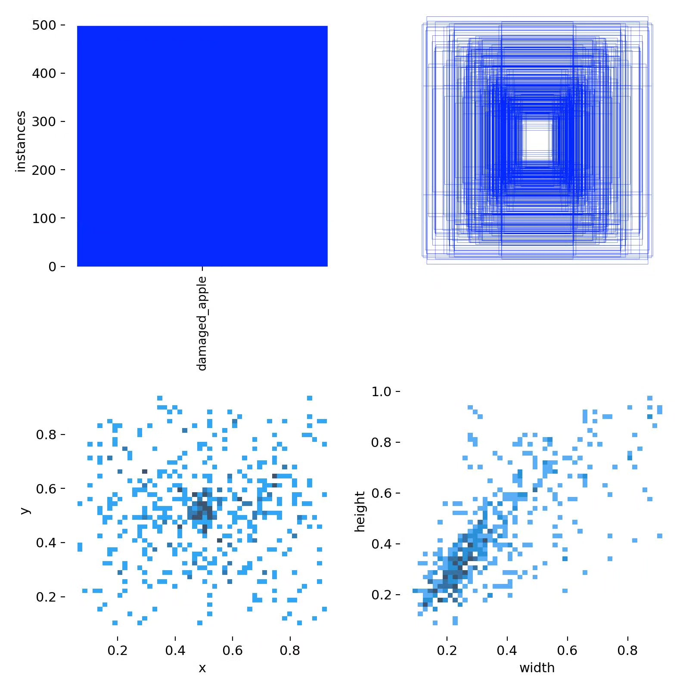
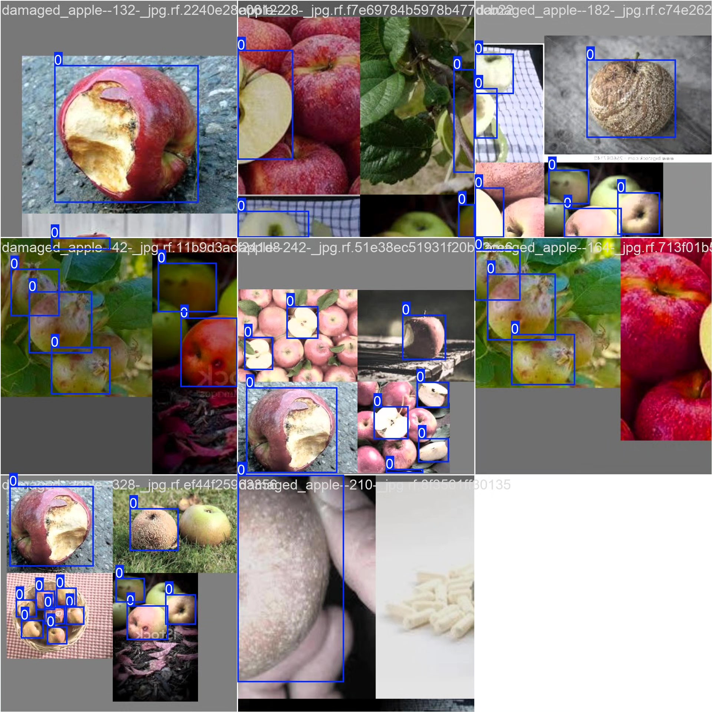

# Based on YOLOv8 deep learning for apple damage detection system (YOLOv8+Y)

## Body

This project is based on the YOLOv8 object detection algorithm, developing a smart apple damage detection system. It focuses on recognizing whether apples are damaged. The system uses a single-class detection ('damaged_apple') and automatically analyzes whether there is damage, rot, or mechanical injuries on the surface of apples through deep learning technology, thereby quickly determining their quality. The dataset contains 356 apple images (253 training set and 103 validation set), after data enhancement and model optimization, the system can detect apple damage efficiently and accurately, suitable for scenarios such as fruit sorting, warehouse management, and retail quality inspection.

The company's products have obtained the official commercial license certification from YOLO.

We provide after-sales service.

After payment, we will provide WeChat ID to answer questions at any time.

Environment configuration: We will provide an environment configuration tutorial, and WeChat will provide answers.

Remote installation service: If you need remote configuration, an additional fee of 69 is required,

Configuration failure, all fees will be refunded (specially for old computers only refund installation fees)

Retraining dataset: After configuring the environment, you can train on your own computer.
If you need us to retrain, just pay 69 + computing power fees (2.5 yuan/hour)

Full after-sales service

## Images

## Payment

Here is a pay link on Stripe ( https://buy.stripe.com/3cs8yP7sY87d0vu9AB ). Please contact me lonlonago@foxmail.com after funding $89, and I will send you a complete data files , thank you!

